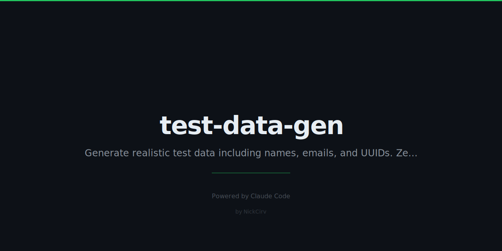

# test-data-gen

> Generate realistic test data — names, emails, addresses, UUIDs — zero dependencies, no faker.js needed.

Pure Node.js, ES modules, zero npm dependencies. Uses `crypto.randomBytes()` for randomness.

## Install

```bash
npm install -g test-data-gen
# or run directly
npx test-data-gen user --count 5
```

## Usage

```bash
test-data-gen <command> [options]
# shorthand alias
tdg <command> [options]
```

## Commands

### `user`
Generate user records with id, name, email, phone, createdAt.

```bash
tdg user --count 3
```
```json
[
  {
    "id": "a3f2b1c4-...",
    "name": "Jane Smith",
    "email": "jane.smith@example.com",
    "phone": "+1-555-0123",
    "createdAt": "2022-07-14T10:30:00.000Z"
  }
]
```

### `address`
Generate US address records.

```bash
tdg address --count 5
```
```json
[
  {
    "street": "742 Oak Ave",
    "city": "Austin",
    "state": "TX",
    "zip": "73356"
  }
]
```

### `uuid`
Generate UUID v4 values.

```bash
tdg uuid --count 10
```

### `date`
Generate random dates within a range.

```bash
tdg date --count 5 --from 2020-01-01 --to 2024-12-31
```

### `credit-card`
Generate Luhn-valid test card numbers using known safe test BINs (Visa 4111... family only).

```bash
tdg credit-card --count 3
```
```json
[
  {
    "number": "4111111111111111",
    "expiry": "09/28",
    "cvv": "742",
    "brand": "Visa (test)"
  }
]
```

### `custom`
Generate from a template string using tokens.

```bash
tdg custom "{{name}} <{{email}}>"
# Jane Smith <jane.smith@example.com>

tdg custom "User {{int:1-1000}} joined on {{date}}" --count 5
```

**Available tokens:**

| Token | Output |
|-------|--------|
| `{{name}}` | Full name |
| `{{email}}` | Email address |
| `{{uuid}}` | UUID v4 |
| `{{phone}}` | US phone number |
| `{{date}}` | ISO datetime |
| `{{word}}` | Random word |
| `{{sentence}}` | Random sentence |
| `{{int:1-100}}` | Integer in range |

### `from-schema`
Generate data matching a JSON Schema.

```bash
tdg from-schema schema.json --count 10
```

**Example schema.json:**
```json
{
  "type": "object",
  "required": ["id", "email", "age"],
  "properties": {
    "id": { "type": "string", "format": "uuid" },
    "email": { "type": "string", "format": "email" },
    "age": { "type": "integer", "minimum": 18, "maximum": 80 },
    "active": { "type": "boolean" }
  }
}
```

## Options

| Flag | Short | Default | Description |
|------|-------|---------|-------------|
| `--count` | `-n` | `1` | Number of records |
| `--format` | `-f` | `json` | Output format: `json`, `csv`, `sql` |
| `--table` | `-t` | `records` | SQL table name |
| `--seed` | `-s` | random | Seed for deterministic output |
| `--from` | | | Start date (YYYY-MM-DD) |
| `--to` | | | End date (YYYY-MM-DD) |
| `--stream` | | | Continuous output mode |

## Output Formats

```bash
# JSON (default)
tdg user --count 5 --format json

# CSV
tdg user --count 100 --format csv > users.csv

# SQL
tdg user --count 10 --format sql --table app_users
# INSERT INTO app_users (id, name, email, phone, createdAt) VALUES (...);
```

## Deterministic Output

Use `--seed` for reproducible data — same seed always produces the same output.

```bash
tdg user --count 5 --seed 42
# Always generates the exact same 5 users
```

## Stream Mode

Continuously emit records for pipe testing.

```bash
tdg user --stream | jq '.email'
# Ctrl+C to stop
```

## Requirements

- Node.js 18+
- Zero external dependencies

## Security Notes

- Credit card numbers use **known test BINs only** (Visa 4111... family) — not real cards
- All randomness uses `crypto.randomBytes()` — not `Math.random()`
- Safe domains only for emails: `example.com`, `test.io`, etc.
- No real people's data — all names are from common name lists

## License

MIT
