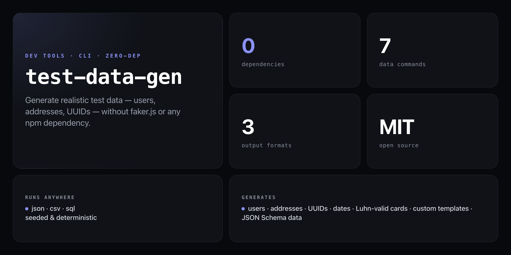

<div align="center">

**Realistic users, addresses, UUIDs, dates, and more — zero dependencies, no faker.js needed.**


</div>

---

Pull in `faker.js` and you've added 3 MB of dependency to your dev toolchain. `test-data-gen` gives you realistic users, addresses, UUIDs, dates, Luhn-valid credit cards, and JSON Schema-driven records from a single `index.js` file — using nothing but Node's built-in `crypto` module.

```
$ npx github:NickCirv/test-data-gen user --count 3
[
  {
    "id": "a3f2b1c4-7e9d-4c1a-b8f2-3d5e6a7b8c9d",
    "name": "Priya Martinez",
    "email": "priya.martinez@example.com",
    "phone": "+1-415-302-7841",
    "createdAt": "2021-04-13T08:22:00.000Z"
  },
  ...
]
```

## Install

No npm account, no global install — run straight from GitHub:

```bash
npx github:NickCirv/test-data-gen
```

## Usage

```bash
# full binary name
test-data-gen <command> [options]

# shorthand alias
tdg <command> [options]
```

## Commands

| Command | What it generates |
|---------|-------------------|
| `user` | id, name, email, phone, createdAt |
| `address` | street, city, state, zip (50 US cities) |
| `uuid` | UUID v4 (crypto-backed) |
| `date` | ISO datetime within a date range |
| `credit-card` | Luhn-valid Visa test numbers only |
| `custom` | Free-form template with `{{tokens}}` |
| `from-schema` | Records matching a JSON Schema file |

## Options

| Flag | Short | Default | Description |
|------|-------|---------|-------------|
| `--count` | `-n` | `1` | Number of records to generate |
| `--format` | `-f` | `json` | Output format: `json`, `csv`, `sql` |
| `--table` | `-t` | `records` | SQL table name (used with `--format sql`) |
| `--seed` | `-s` | random | Seed for deterministic, reproducible output |
| `--from` | | | Start date for range (YYYY-MM-DD) |
| `--to` | | | End date for range (YYYY-MM-DD) |
| `--stream` | | | Emit records continuously (Ctrl+C to stop) |
| `--help` | `-h` | | Show help |

## Output Formats

```bash
# JSON (default)
tdg user --count 5

# CSV — pipe straight to a file
tdg user --count 100 --format csv > users.csv

# SQL INSERT statements
tdg user --count 10 --format sql --table app_users
# INSERT INTO app_users (id, name, email, phone, createdAt) VALUES (...);
```

## Deterministic Output

Use `--seed` for reproducible fixtures — same seed, same data, every time:

```bash
tdg user --count 5 --seed 42
```

## Custom Templates

Build any string format using `{{tokens}}`:

```bash
tdg custom "{{name}} <{{email}}>" --count 3
# Hiroshi Webb <hiroshi.webb@test.io>

tdg custom "User {{int:1-1000}} joined on {{date}}" --count 5
```

| Token | Output |
|-------|--------|
| `{{name}}` | Full name |
| `{{email}}` | Email address |
| `{{uuid}}` | UUID v4 |
| `{{phone}}` | US phone number |
| `{{date}}` | ISO datetime |
| `{{word}}` | Random word |
| `{{sentence}}` | Random sentence |
| `{{int:1-100}}` | Integer in range |

## JSON Schema Generation

Generate records matching any JSON Schema:

```bash
tdg from-schema schema.json --count 10
```

```json
{
  "type": "object",
  "required": ["id", "email", "age"],
  "properties": {
    "id": { "type": "string", "format": "uuid" },
    "email": { "type": "string", "format": "email" },
    "age": { "type": "integer", "minimum": 18, "maximum": 80 },
    "active": { "type": "boolean" }
  }
}
```

Supported types: `string` (with `format`: `uuid`, `email`, `date-time`, `date`), `integer`, `number`, `boolean`, `array`, `object`, `null`, `enum`, `oneOf`, `anyOf`.

## Security Notes

- Credit cards use **known test BINs only** (Visa `4111...` family) — Luhn-valid, never real
- All randomness uses `crypto.randomBytes()` — not `Math.random()`
- Email domains are safe test-only: `example.com`, `test.io`, `mockmail.io`, etc.
- No real people's data — names drawn from common name lists

## What it is NOT

- **Not a production data faker.** It generates test fixtures for development and CI — not representative samples for analytics or load testing at scale.
- **Not a schema validator.** `from-schema` generates plausible data; it does not enforce every JSON Schema constraint (e.g. `uniqueItems`, `pattern`).
- **Not a replacement for a database seed file.** For complex relational fixtures with foreign-key integrity, you still need a seed script — this tool feeds the raw data into it.

---

<div align="center">
<sub>Zero dependencies · Node 18+ · MIT · by <a href="https://github.com/NickCirv">NickCirv</a></sub>
</div>
